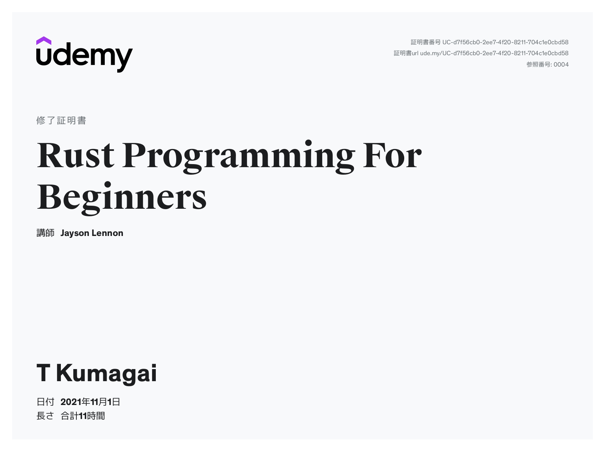

# udemy-rust-begginer

## 目的
O'REILLY の プログラミング Rustを読み込む前にRustの特徴をUdemyのコースで受講して基礎力をアップさせる。

## Udemyのコース

サンプルが最初から用意されており始めやすいので以下のコースを選択

[Rust Programming For Beginners](https://www.udemy.com/course/rust-coding-for-beginners/)

---

